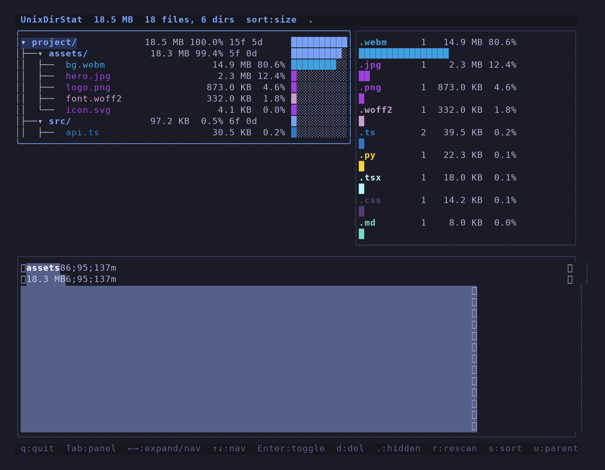

# UnixDirStat

A terminal-based disk-usage analyzer with a squarified treemap, file-type
breakdown, and an interactive tree view. Inspired by WinDirStat, built for
the terminal.



## Features

- WinDirStat-style layout: tree + extension list on top, treemap full width below
- Concurrent scanner (semaphore-bounded goroutine pool, no deadlock on large trees)
- Squarified treemap with live updates during scan
- File extension breakdown with colored bars
- Interactive tree view with expand/collapse
- Arrow-key navigation (left/right collapse/expand + descend, like Explorer)
- Delete files/dirs from within the TUI (with confirmation)
- Three sort modes: size, name, file count
- Dotfile visibility toggle
- Breadcrumb path display
- Headless scan mode (`-scan`)

## Building

```bash
go build -o unixdirstat .
```

## Usage

```bash
# Interactive TUI
./unixdirstat [path]

# Headless scan (prints summary, then exits)
./unixdirstat -scan [path]

# Follow symlinks (with cycle protection)
./unixdirstat -L [path]

# Limit concurrent workers
./unixdirstat -workers 32 [path]
```

## Keybindings

| Key      | Action                              |
|----------|-------------------------------------|
| q        | Quit                                |
| Tab      | Cycle panels (Tree -> Ext -> Treemap)|
| ← / h    | Collapse dir / jump to parent       |
| → / l    | Expand dir / descend into first child|
| ↑ / k    | Move cursor up                      |
| ↓ / j    | Move cursor down                    |
| Enter    | Expand/collapse directory           |
| d        | Delete file/dir (with confirmation) |
| .        | Toggle hidden files                 |
| r        | Rescan                              |
| s        | Cycle sort mode (size/name/count)   |
| u        | Jump to parent directory            |
| /        | Change scan path                    |

## Architecture

```
main.go        Entry point, flag parsing, headless mode
scanner.go     Concurrent directory scanner (semaphore pool)
model.go       BubbleTea model: state, event handling, layout
views.go       Rendering: header, footer, tree, extensions, treemap panels
tree.go        Tree flattening with sort modes and depth limit
treemap.go     Squarified treemap algorithm + item builder
colors.go      Extension color palette
utils.go       Size/percent formatting, extension grouping, sanitization
```

## Performance

Scans ~300K files across ~36K directories in ~6 seconds on a 4-core VM.
The scanner uses a bounded goroutine pool (default 64 workers) with a
semaphore channel to prevent deadlock on deep directory trees.

The treemap renderer fills rectangles with one `lipgloss.Render` call per
row (not per cell), keeping rendering fast even on large trees.

## Comparison with WinDirStat

| Feature                   | WinDirStat          | UnixDirStat              |
|---------------------------|---------------------|--------------------------|
| Platform                  | Windows             | Linux/macOS (terminal)   |
| Treemap                   | Yes                 | Yes (squarified)         |
| Extension list            | Yes (colored)       | Yes (colored)            |
| Tree view                 | Yes                 | Yes                      |
| Delete from UI            | Yes                 | Yes                      |
| Scan progress             | Visual (pacman)     | Live counters + path     |
| Symlink handling          | N/A (Windows)       | Cycle-protected (-L)     |
| Concurrent scanning       | Single-threaded     | 64-worker pool           |
| Headless mode             | No                  | Yes (-scan)              |
| Sort modes                | Size only           | Size / name / count      |
| File/dir counts in tree   | No                  | Yes                      |
| Config file               | Yes (colors etc.)   | No (built-in palette)    |
| Cleanup actions           | Yes (context menu)  | No                       |
| Remote/SSH                | No                  | Yes (run over SSH)       |
| Resource usage            | GUI (~50MB RAM)     | TUI (~10MB RAM)          |

### What WinDirStat has that UnixDirStat doesn't (yet)

- **Cleanup wizard**: Empty recycle bin, delete temp files, etc.
- **Custom color mapping**: Users can assign colors to extensions.
- **Zoomable treemap**: Click to drill into a subtree.
- **Disk performance test**: Sequential read benchmark.

### What UnixDirStat has that WinDirStat doesn't

- **Runs in a terminal**: SSH-friendly, no X11/Wayland needed.
- **Concurrent scanner**: Multi-core scan, ~10x faster on large trees.
- **Headless mode**: Script-friendly summary output.
- **Three sort modes**: Switch between size/name/count without rescanning.
- **Breadcrumb paths**: Compact `~/path/to/dir` display.
- **File/dir counts per directory**: See item counts alongside sizes.

## Testing

```bash
go test -v ./...
```

20 tests covering scanner, treemap algorithm, tree flattening, sort modes,
sanitization, breadcrumb paths, and edge cases (empty dirs, symlinks,
cycles, hidden files).
